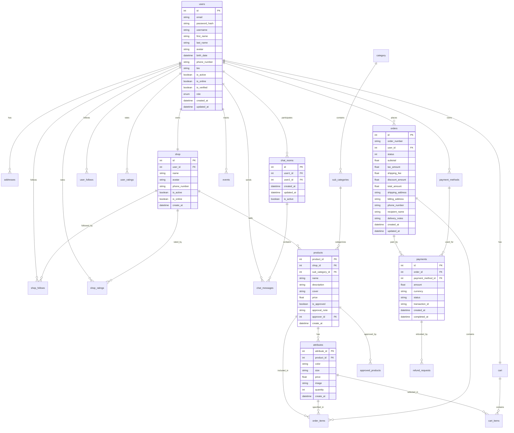

# 🛒 GreenBuy - E-commerce API Platform

## 📋 Tổng quan dự án

GreenBuy là một nền tảng thương mại điện tử hiện đại được xây dựng với FastAPI và PostgreSQL. Hệ thống hỗ trợ đầy đủ các tính năng từ quản lý sản phẩm, giỏ hàng, đơn hàng đến thanh toán và chat real-time.

## 🏗️ Kiến trúc hệ thống

### **Backend Architecture**
```
┌─────────────────┐    ┌─────────────────┐    ┌─────────────────┐
│   FastAPI App   │    │   PostgreSQL    │    │   WebSocket     │
│   (Python 3.12) │◄──►│   (TimescaleDB) │    │   (Chat)        │
└─────────────────┘    └─────────────────┘    └─────────────────┘
         │                       │                       │
         ▼                       ▼                       ▼
┌─────────────────┐    ┌─────────────────┐    ┌─────────────────┐
│   REST API      │    │   Database      │    │   Real-time     │
│   Endpoints     │    │   Migrations    │    │   Messaging     │
└─────────────────┘    └─────────────────┘    └─────────────────┘
```

### **Technology Stack**

| Layer | Technology | Version | Purpose |
|-------|------------|---------|---------|
| **Framework** | FastAPI | 0.115.12 | Modern, fast web framework |
| **Database** | PostgreSQL + TimescaleDB | 17 | Time-series & relational data |
| **ORM** | SQLModel | Latest | Type-safe database operations |
| **Authentication** | JWT + bcrypt | Latest | Secure user authentication |
| **Real-time** | WebSocket | Latest | Live chat functionality |
| **Container** | Docker | Latest | Containerization |
| **Deployment** | Docker Compose | Latest | Multi-service orchestration |

## 🗄️ Database Schema

### **Core Entities & Relationships**



## 🚀 API Endpoints

### **Authentication & User Management**
```http
POST   /token                    # Login
POST   /token/refresh           # Refresh token
POST   /logout                  # Logout
POST   /logout-all              # Logout all devices
GET    /api/user/me             # Get current user
PUT    /api/user/profile        # Update profile
```

### **Shop Management**
```http
GET    /api/shops/me            # Get my shop
POST   /api/shops/              # Create shop
PUT    /api/shops/me            # Update shop
GET    /api/shops/{id}          # Get shop by ID
GET    /api/shops/me/stats      # Shop statistics
```

### **Product Management**
```http
GET    /api/product/            # List products (with pagination)
POST   /api/product/            # Create product
GET    /api/product/{id}        # Get product details
PUT    /api/product/{id}        # Update product
DELETE /api/product/{id}        # Delete product
GET    /api/product/by-status/{status}  # Filter by status
```

### **Cart & Orders**
```http
GET    /api/cart/me             # Get my cart
POST   /api/cart/items          # Add to cart
PUT    /api/cart/items/{id}     # Update cart item
DELETE /api/cart/items/{id}     # Remove from cart

GET    /api/order/              # List orders
POST   /api/order/              # Create order
GET    /api/order/{id}          # Get order details
PATCH  /api/order/{id}/status   # Update order status
```

### **Payment System**
```http
GET    /api/payment/methods     # List payment methods
POST   /api/payment/methods     # Add payment method
POST   /api/payment/process/{order_id}  # Process payment
POST   /api/payment/refund      # Request refund
```

### **Real-time Chat**
```http
GET    /api/chat/rooms          # List chat rooms
POST   /api/chat/rooms          # Create chat room
GET    /api/chat/rooms/{id}/messages  # Get messages
POST   /api/chat/rooms/{id}/messages  # Send message
```

## 🔧 Cài đặt & Chạy

### **Prerequisites**
- Docker & Docker Compose
- Python 3.12+
- PostgreSQL (TimescaleDB)

### **Quick Start**

1. **Clone repository**
```bash
git clone <repository-url>
cd GreenBuy
```

2. **Setup environment**
```bash
cp .env.example .env
# Edit .env with your database credentials
```

3. **Run with Docker**
```bash
docker-compose up -d
```

4. **Run migrations**
```bash
docker-compose exec app alembic upgrade head
```

5. **Access API**
- API Documentation: http://localhost:8002/docs
- Health Check: http://localhost:8002/healthz

### **Development Setup**

1. **Create virtual environment**
```bash
python -m venv venv
source venv/bin/activate  # On Windows: venv\Scripts\activate
```

2. **Install dependencies**
```bash
pip install -r requirements.txt
```

3. **Run development server**
```bash
cd src
uvicorn main:app --reload --host 0.0.0.0 --port 8002
```

## 📊 Tính năng chính

### **🛍️ E-commerce Features**
- ✅ Quản lý sản phẩm với attributes (màu sắc, kích thước)
- ✅ Giỏ hàng thông minh
- ✅ Hệ thống đơn hàng với trạng thái chi tiết
- ✅ Thanh toán đa phương thức
- ✅ Đánh giá và review
- ✅ Theo dõi shop/user

### **💬 Social Features**
- ✅ Chat real-time giữa users
- ✅ Follow/Unfollow users và shops
- ✅ Rating và review system
- ✅ Event tracking

### **🔐 Security Features**
- ✅ JWT Authentication
- ✅ Password hashing với bcrypt
- ✅ Role-based access control
- ✅ Token blacklisting
- ✅ Rate limiting

### **📱 Mobile-Friendly**
- ✅ RESTful API design
- ✅ Pagination support
- ✅ File upload handling
- ✅ Real-time notifications
- ✅ Optimized responses

## 🗂️ Project Structure

```
GreenBuy/
├── src/
│   ├── api/
│   │   ├── auth/           # Authentication & JWT
│   │   ├── user/           # User management
│   │   ├── shop/           # Shop management
│   │   ├── product/        # Product management
│   │   ├── cart/           # Shopping cart
│   │   ├── order/          # Order management
│   │   ├── payment/        # Payment processing
│   │   ├── chat/           # Real-time chat
│   │   ├── address/        # Address management
│   │   ├── category/       # Product categories
│   │   ├── attribute/      # Product attributes
│   │   └── db/             # Database configuration
│   ├── static/             # Static files (images)
│   ├── alembic/            # Database migrations
│   └── main.py             # FastAPI application
├── docker-compose.yml       # Docker orchestration
├── Dockerfile.web          # Docker configuration
├── requirements.txt         # Python dependencies
└── README.md              # This file
```

## 🔄 Database Migrations

Hệ thống sử dụng Alembic để quản lý database migrations:

```bash
# Tạo migration mới
alembic revision --autogenerate -m "Description"

# Chạy migrations
alembic upgrade head

# Rollback migration
alembic downgrade -1
```

## 🧪 Testing

```bash
# Run tests (if available)
pytest

# Run with coverage
pytest --cov=src
```

## 📈 Performance

- **Database**: TimescaleDB cho time-series data
- **Caching**: Redis (có thể thêm)
- **Load Balancing**: Docker Compose
- **Monitoring**: Health check endpoints

## 🔒 Security

- **Authentication**: JWT tokens
- **Password**: bcrypt hashing
- **CORS**: Configured for cross-origin requests
- **Input Validation**: Pydantic models
- **SQL Injection**: SQLModel ORM protection

## 📝 API Documentation

Truy cập Swagger UI tại: `http://localhost:8002/docs`

## 🤝 Contributing

1. Fork the repository
2. Create feature branch (`git checkout -b feature/amazing-feature`)
3. Commit changes (`git commit -m 'Add amazing feature'`)
4. Push to branch (`git push origin feature/amazing-feature`)
5. Open Pull Request

## 📄 License

This project is licensed under the MIT License - see the [LICENSE](LICENSE) file for details.

## 📞 Support

- **Email**: support@greenbuy.com
- **Documentation**: [API Docs](http://localhost:8002/docs)
- **Issues**: [GitHub Issues](https://github.com/your-repo/issues)

---

**GreenBuy** - Modern E-commerce Platform 🚀