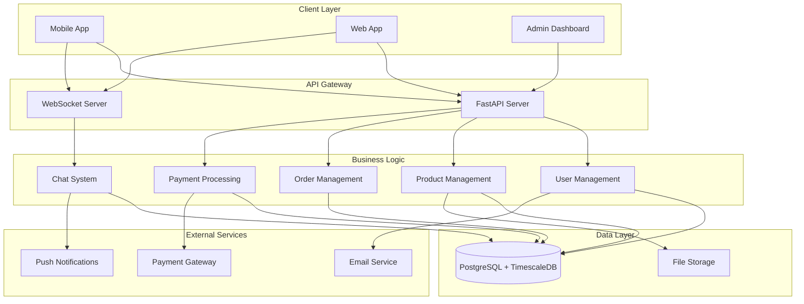
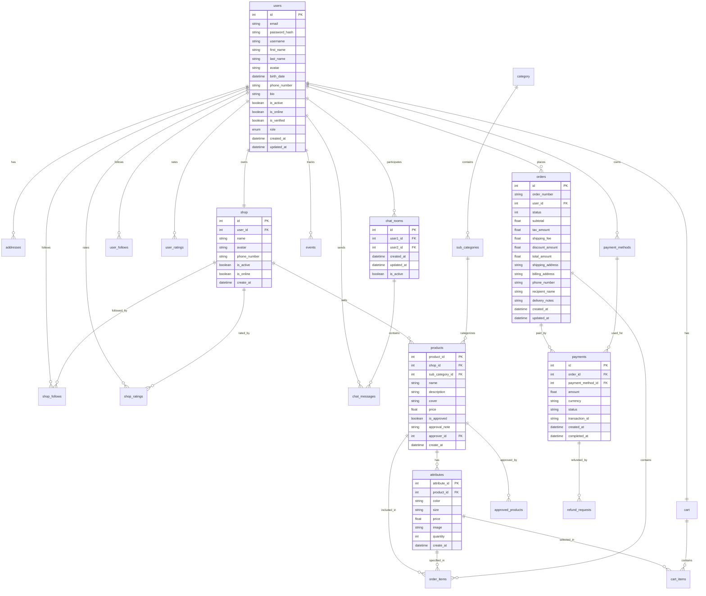
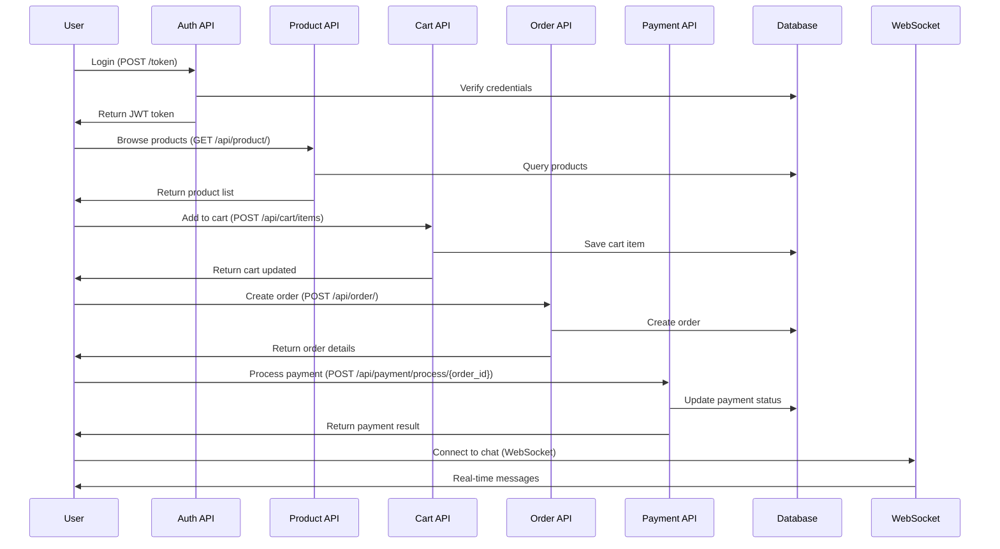
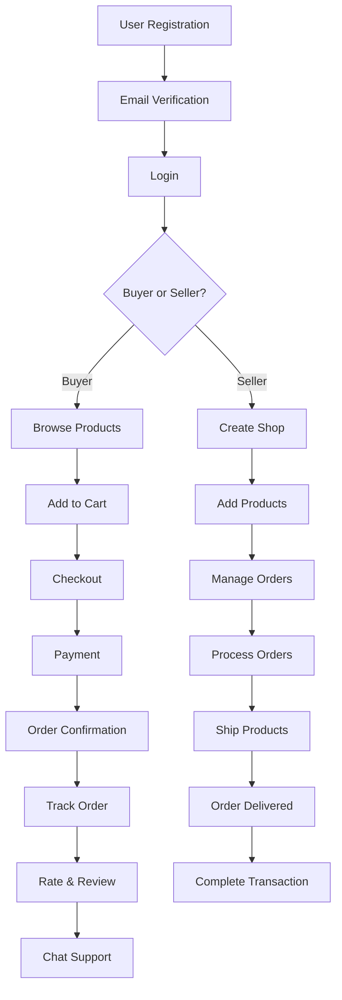
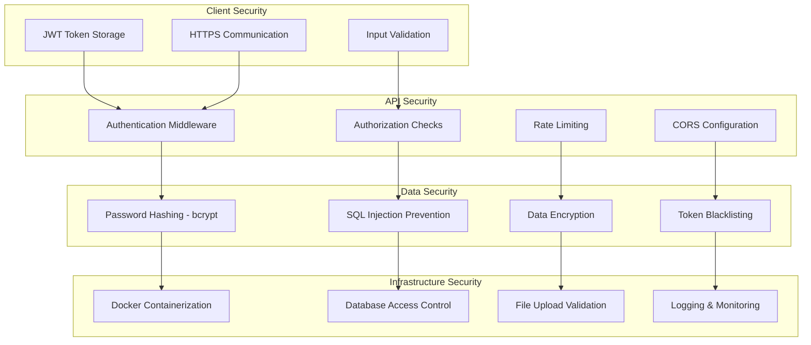
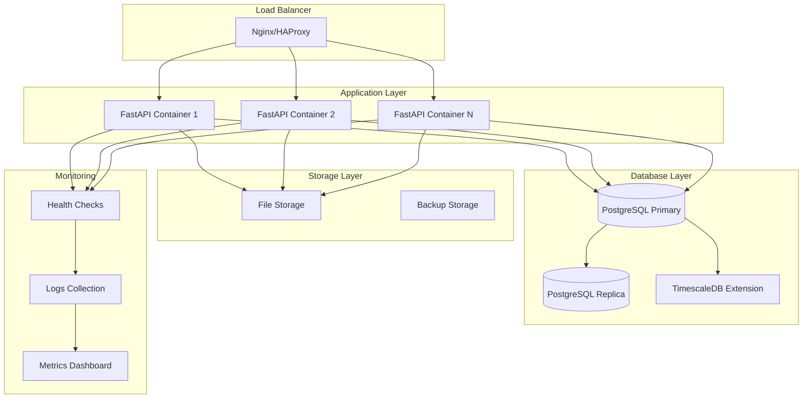
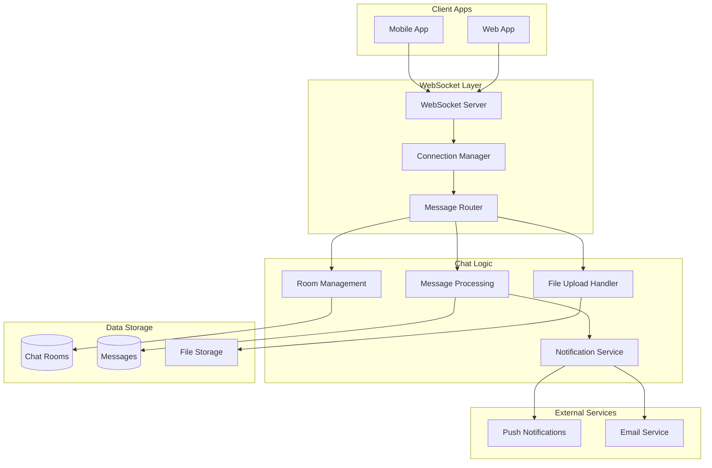
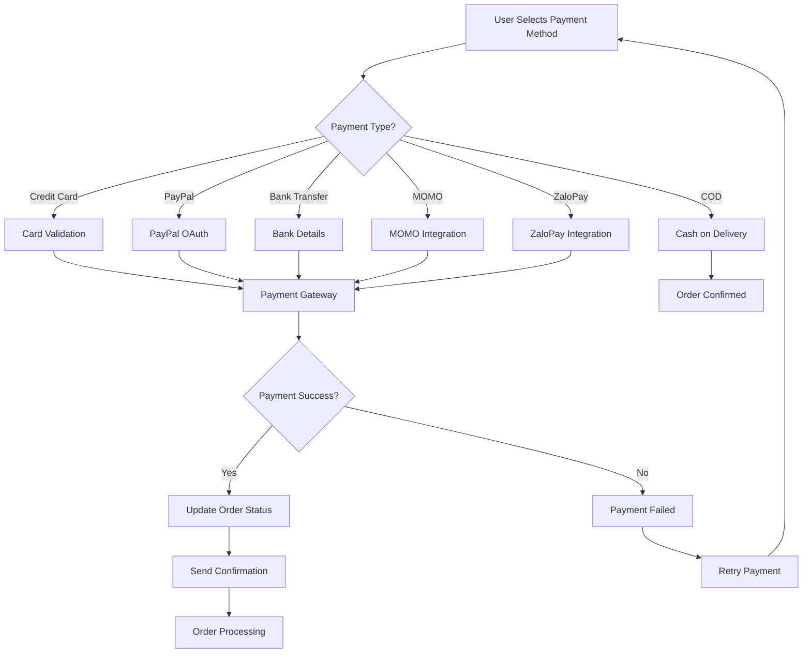
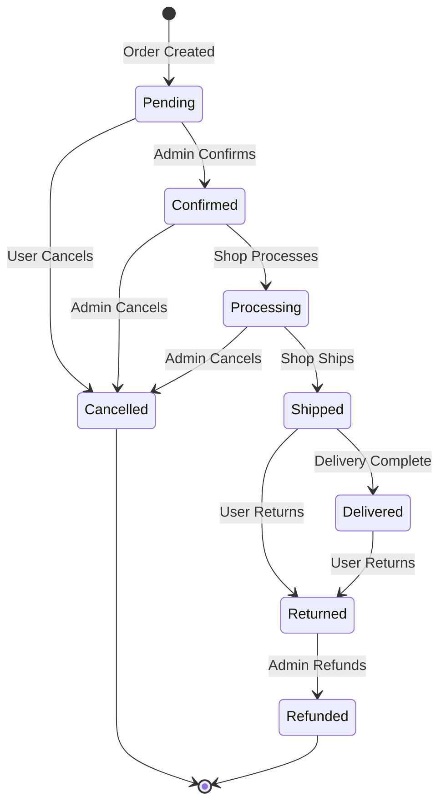
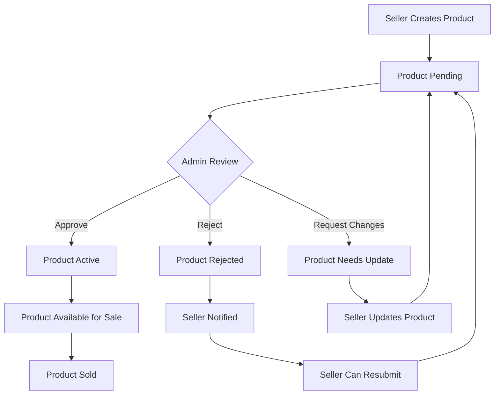

# 🏗️ GreenBuy Architecture Diagrams

## 1. System Architecture Overview

## 2. Database Entity Relationship Diagram

## 3. API Flow Diagram

## 4. User Journey Flow

## 5. Security Architecture

## 6. Deployment Architecture

## 7. Chat System Architecture

## 8. Payment Flow

## 9. Order Status Flow

## 10. Product Approval Flow

---

## 📊 Diagram Usage

Các diagram này có thể được sử dụng để:

1. **Documentation** - Tài liệu kỹ thuật
2. **Presentations** - Trình bày cho stakeholders
3. **Development** - Hướng dẫn cho developers
4. **Architecture Reviews** - Đánh giá kiến trúc
5. **Onboarding** - Hướng dẫn cho team mới

## 🛠️ Tools để tạo diagram:

- **Mermaid** - Tích hợp với GitHub/GitLab
- **Draw.io** - Diagram editor online
- **Lucidchart** - Professional diagramming
- **PlantUML** - Code-based diagrams
- **Figma** - Design & prototyping

## 📝 Export Options:

- **PNG** - Cho presentations
- **SVG** - Cho web
- **PDF** - Cho documentation
- **Mermaid** - Cho version control 